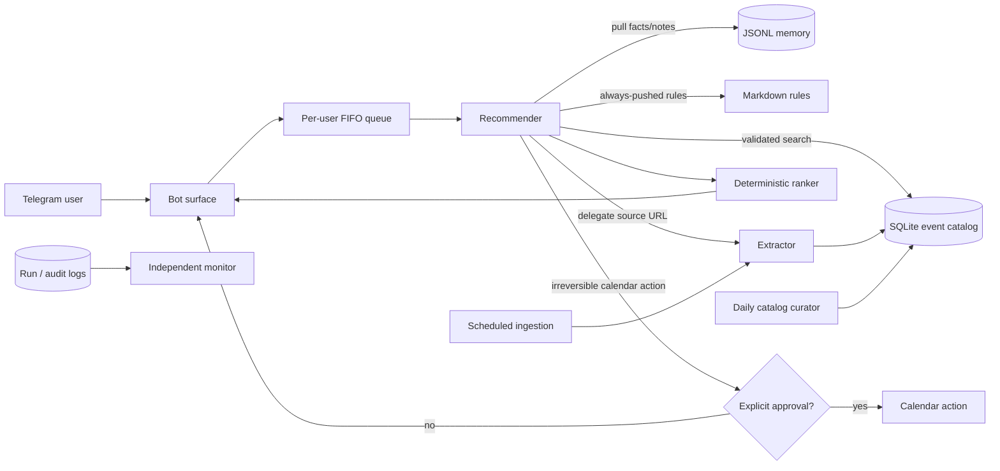
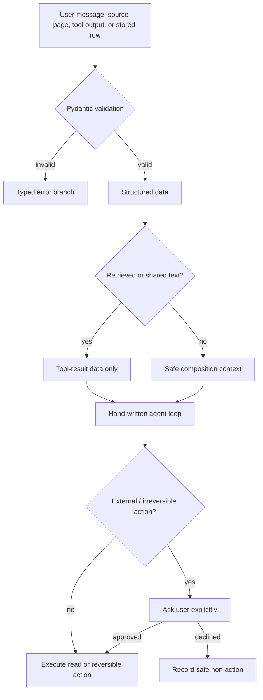
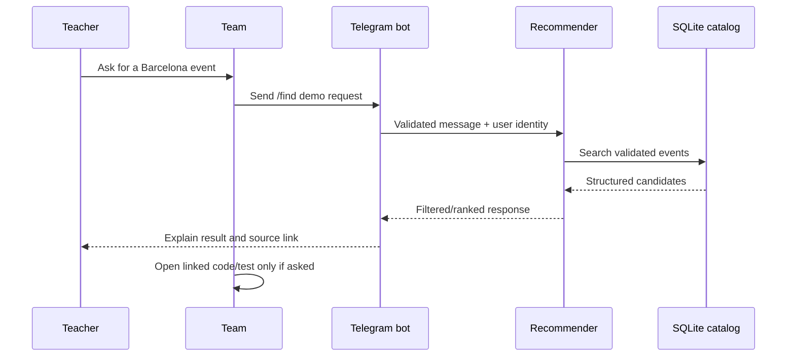

# Planazo demo guide

This is a short map from each course requirement to Planazo's implementation.
Use it during the presentation: start with the answer in the **What we show**
column, then open the linked implementation or test if the teacher asks how it
works. This document describes the project, not the individual submission
process.

## One-minute project explanation

Planazo is a Barcelona event-discovery assistant. It receives a request,
interprets it into a validated search intent, searches the validated event
catalog, filters and ranks results deterministically, and can prepare a
calendar action only after explicit approval. It is agentic because its
Recommender uses a hand-written **observe → reason → act → verify** loop, not a
fixed script or an agent framework.

The main safety idea is: **untrusted text is data, every boundary is typed, and
external actions require approval**. The architecture is documented in
[MVP architecture](docs/MVP-ARCHITECTURE.md) and the rules enforced across the
repository are in [AGENTS.md](AGENTS.md).

## System at a glance



The picture is useful because it shows the three different responsibilities:
the Recommender serves the user, the Extractor handles messy sources, and the
Curator maintains shared catalog data. The monitor observes them afterward; it
does not sit inside a user turn.

## Project structure: where everything lives

The repository separates product code by responsibility. In the demo, start at
`src/planazo/`, then follow a link only when someone asks about that part of the
system.

```text
planazo/
├── src/planazo/       Application code, divided into bounded contexts
├── tests/             Automated behaviour and contract tests
├── docs/              Architecture, ADR decisions, and demo evidence
├── data/              Versioned rules and source configuration
├── var/               Local runtime data and audit logs (not product source)
├── scripts/           Small developer and evidence-supporting scripts
├── docker/            Container configuration for source adapters
├── .claude/           Team development skills and agent roles
├── .github/           GitHub templates and automation configuration
├── agent/             Earlier agent experiments kept for reference
├── AGENTS.md          Non-negotiable engineering and safety rules
└── README-package.md  Setup instructions and package-level orientation
```

### `src/planazo/`: the application contexts

| Folder | Contains | Use it to answer |
| --- | --- | --- |
| [agents](src/planazo/agents/) | The hand-written agent loop, Recommender composition, CLI, and extraction delegation. | “Where is the agent loop?” |
| [bot](src/planazo/bot/) | Telegram application, incoming-message surface, configuration, and per-user queue. | “How does a real user talk to it?” |
| [query](src/planazo/query/) | Validated `SearchIntent` and trusted search-origin models. | “How do you turn a request into safe search data?” |
| [catalog](src/planazo/catalog/) | Event schema, SQLite repository, and typed search/save tools. | “Where are events stored and searched?” |
| [rank](src/planazo/rank/) | Deterministic event scoring and user-facing reasons. | “Does the LLM decide the ranking?” |
| [identity](src/planazo/identity/) | User and persisted preference records. | “Where are user preferences kept?” |
| [memory](src/planazo/memory/) | JSONL facts/notes, Markdown-rule loading, and identity-bound memory tools. | “How do facts, rules, and shared memory differ?” |
| [extraction](src/planazo/extraction/) | Typed extraction contracts and multimedia-profile validation. | “How is messy source content made safe?” |
| [sources](src/planazo/sources/) | Instagram source adapters and source-config validation. | “Where do external event posts enter?” |
| [scheduler](src/planazo/scheduler/) | Timed ingestion, silence/gate decisions, and scheduler audit records. | “What runs without a Telegram message?” |
| [curator](src/planazo/curator/) | Privileged daily catalog-maintenance agent and its dry-run/audit paths. | “What is the admin subagent?” |
| [approval](src/planazo/approval/) and [calendar](src/planazo/calendar/) | The explicit approval gate and calendar draft/action contracts. | “How are real external actions controlled?” |
| [monitor](src/planazo/monitor/) and [observability](src/planazo/observability/) | Independent run evaluation plus durable, sanitized run/decision/recommendation records. | “How do you monitor and audit the agents?” |
| [conversation](src/planazo/conversation/) | Multi-turn clarification state and follow-up handling. | “How does the bot remember an unfinished request?” |
| [storage](src/planazo/storage/) and [interfaces](src/planazo/interfaces/) | SQLite migrations/connection setup and shared runtime protocol surfaces. | “Where are persistence and compatibility contracts defined?” |

### Supporting folders

| Folder | What it is for |
| --- | --- |
| [tests](tests/) | The fastest proof that a claimed behavior is enforced. Test names mirror the contexts above. |
| [docs/adr](docs/adr/) | Numbered Architecture Decision Records: the reason behind load-bearing choices. |
| [docs/evidence](docs/evidence/) | Reproducible scheduler and curator demo evidence. |
| [data/rules](data/rules/) | Operator-authored rules that are safely pushed into Recommender context. |
| [data/sources.yaml](data/sources.yaml) | Validated source configuration used by scheduled ingestion. |
| [.claude](.claude/) | The repository’s planning, review, and implementation workflow—not application runtime code. |

## Safety decisions in one picture



This is the answer to “how do you stop the agent from trusting everything it
reads?”: validation controls shape; message roles control whether text can act
as instruction; the approval gate controls external effects.

## ADR map — why the architecture looks this way

ADRs are the project’s decision history. For the demo, these are the most
useful ones to know:

| Decision | ADR | Practical effect in the demo |
| --- | --- | --- |
| Hand-written loop and tool/approval contract | [0001](docs/adr/0001-agent-runtime-layout-and-provider.md), [0002](docs/adr/0002-event-tool-contracts-and-approval-gate.md) | We can point to our own loop and explain why calendar creation is gated. |
| SQLite event catalog | [0003](docs/adr/0003-sqlite-domain-store.md) | Events are structured records that can be searched, filtered, and audited. |
| Three stores and safe memory scope | [0004](docs/adr/0004-three-store-memory-model.md) | Facts, shared notes, and rules have different storage and trust behavior. |
| Recommender + Extractor split | [0005](docs/adr/0005-multi-agent-shape.md) | The second agent has a bounded delegation brief and typed hand-off. |
| Monitor with categorical rationale | [0007](docs/adr/0007-monitor-scheduling-and-grades.md) | Monitoring is outside the request loop and must explain its verdict. |
| Telegram and queue behavior | [queue ADR 0019](docs/adr/0019-per-user-message-serialization.md) | The bot has a real channel and preserves order for one user without blocking everyone. |
| Trusted radius and deterministic recommendations | [0014](docs/adr/0014-deterministic-ranking-boundary.md) | Coordinates are application-owned; ranking is repeatable and not an LLM opinion. |
| Admin curator | [0020](docs/adr/0020-catalog-curator-agent.md) | A separate privileged agent maintains stale/duplicate/misclassified catalog records. |

---

## tools, loop, approval, errors

| Requirement | What we show / say | Where it is implemented and tested |
| --- | --- | --- |
| Two real, team-designed tools | `search_events` reads validated events from SQLite; `save_memory` persists a user fact to JSONL; `save_event` persists extracted catalog events. Their schemas have action names, descriptions, typed parameters, and validation. | [catalog tools](src/planazo/catalog/tools.py), [memory tool closures](src/planazo/memory/api.py), [event schema](src/planazo/catalog/models.py), [tool-schema tests](tests/test_tools_schema.py) |
| Observe → reason → act → verify loop | `run_loop` calls the model, checks for tool calls, dispatches them, appends the tool result, and repeats. It stops on a model answer, truncation, or `max_steps`. | [hand-written loop](src/planazo/agents/loop.py), [loop tests](tests/test_agents_loop.py) |
| Explicit stop condition | The loop has a configurable `max_steps` cap; normal runs also stop when the model returns no tool calls. The curator has its own capped loop too. | [loop stopping logic](src/planazo/agents/loop.py), [curator max-step policy](src/planazo/curator/agent.py) |
| Human approval for irreversible action | Calendar creation is behind `ApprovalGate`. The terminal and Telegram surfaces ask the user; a declined action is not dispatched. Read-only search and reversible drafts are not gated. | [approval gate](src/planazo/approval/gate.py), [calendar tools](src/planazo/calendar/), [CLI gate](src/planazo/agents/cli.py), [gate tests](tests/test_agents_gate_live.py) |
| A tool error becomes a branch | A raised tool, unknown tool, or non-serializable result becomes `{"tool_failed": true, ...}` rather than a fake success. Catalog, extraction, memory, and Recommender failures use typed error states. | [failure marker](src/planazo/agents/loop.py), [typed catalog errors](src/planazo/catalog/tools.py), [loop tests](tests/test_agents_loop.py) |

**Good demo sentence:** “The model proposes a tool call, but our code owns the
tool schema, dispatch, error branch, stop condition, and approval decision.”

---

## memory, multiple agents, and monitoring

### 1. Three stores plus push and pull context

| Requirement | Planazo answer | Where to open |
| --- | --- | --- |
| Relational domain store | SQLite stores structured `Event`, user, preference, approval, run, and catalog state rows. Events are queryable/filterable records, not a key-value dump. | [catalog repository](src/planazo/catalog/repository.py), [storage migrations](src/planazo/storage/migrations/) |
| Non-relational memory store | Free-form facts and event notes live in JSONL document stores, separated into private-user and shared scopes. | [facts and notes](src/planazo/memory/facts.py), [memory models](src/planazo/memory/models.py) |
| Markdown operating rules | Markdown files in `data/rules/` are loaded on every Recommender run, so an operator can change rules without changing Python. | [rule loader](src/planazo/memory/rules.py), [rules tests](tests/test_memory_rules.py) |
| Push context | Rules, bounded validated preferences, and safe intent fields are assembled before the loop. Raw retrieved content never enters the system prompt. | [Recommender composition](src/planazo/agents/event_agent.py), [preference safety ADR](docs/adr/0011-preference-push-context-safety.md) |
| Pull context | The model must call `retrieve_memory` or `retrieve_notes` when it needs facts/notes. Results arrive as tool output, not system instructions. | [memory API](src/planazo/memory/api.py), [memory-resurface tests](tests/agents/test_memory_resurfaces.py) |

### 2. Facts versus rules

- A **fact** is a cued, free-form memory, for example a user preference. The
  model decides whether it is relevant after retrieval.
- A **rule** is operator-authored behavior guidance that is always pushed into
  the run; the model does not decide whether the rule exists.

Open [ADR 0004](docs/adr/0004-three-store-memory-model.md) for the rationale,
or run/read [memory resurface tests](tests/agents/test_memory_resurfaces.py).

### 3. Private, shared, and untrusted memory

| Question | Answer |
| --- | --- |
| How does private memory stay private? | Tool functions are closures bound to the authenticated `user_id`; the model never receives a `user_id` parameter it can change. Private files are scoped by that validated identity. |
| How is shared memory shared? | A shared scope has a common JSONL store, so another user can retrieve shared facts/notes. |
| Why is shared content safe? | It is returned only as a tool result. It is never concatenated into the system message, so a planted “ignore instructions” note is data, not an instruction. |

Show [ADR 0004](docs/adr/0004-three-store-memory-model.md),
[memory API](src/planazo/memory/api.py), and the scenario tests in
[tests/agents](tests/agents/). The evidence-trace names referenced by the
architecture are `private-memory.md`, `shared-memory.md`, and
`untrusted-content.md` under `docs/evidence/` when generated for a demo.

### 4. Executor plus another agent

Planazo has a real split of labor:

- The **Recommender** handles the user request, catalog search, filtering,
  preferences, and candidate result.
- The **Extractor** handles one source URL/post and returns a typed
  `ExtractionResult`; it has a written delegation brief, a limited tool set,
  and an effort/step budget.
- They coordinate through shared catalog state (`events`) and correlated run
  identifiers/audit records. Shared coordination is hard to debug because a
  later agent can observe a prior agent's data; run IDs and structured audit
  logs make the hand-off traceable.

Open [Extractor agent and delegation brief](src/planazo/agents/extractor.py),
[multi-agent ADR](docs/adr/0005-multi-agent-shape.md), and
[extractor tests](tests/test_agents_extractor.py).

### 5. Monitor on its own clock

The monitor is separate from the request loop. It reads completed run logs
after the fact and uses named categorical verdicts plus a required rationale;
it does not return a vague 1–10 score. Its job can report prompt-adherence or
task-completion problems with the expected-versus-observed reason.

| Show | File |
| --- | --- |
| Monitor model, categorical grades, rationale invariant | [monitor models](src/planazo/monitor/models.py) |
| Judge and scheduled service | [judge](src/planazo/monitor/judge.py), [service](src/planazo/monitor/service.py) |
| Run-log writer | [monitor logging](src/planazo/monitor/logging.py) |
| Tests | [monitor tests](tests/test_monitor_judge.py), [service tests](tests/test_monitor_service.py) |
| Design decision | [ADR 0007](docs/adr/0007-monitor-scheduling-and-grades.md) |

---

## real channel, triggers, silence, queue, admin helper

| Requirement | What we show / say | Where it is implemented and tested |
| --- | --- | --- |
| Real channel | Planazo has a Telegram bot surface. Incoming Telegram payloads are validated before they reach application code. | [bot app](src/planazo/bot/app.py), [surface](src/planazo/bot/surface.py), [bot tests](tests/test_bot_app.py) |
| Disposable identity | The bot uses a `TELEGRAM_BOT_TOKEN` from `.env`; the repository does not contain a token. For the demo we use a dedicated bot account, not a personal account. | [.env example](.env.example), [bot configuration](src/planazo/bot/config.py) |
| Non-message triggers | Scheduled ingestion checks configured Instagram sources on its cadence; the catalog curator runs separately on a daily cron. These background paths are independent of a Telegram message. | [scheduler CLI](src/planazo/scheduler/cli.py), [scheduler service](src/planazo/scheduler/service.py), [curator CLI](src/planazo/curator/cli.py), [ADR 0020](docs/adr/0020-catalog-curator-agent.md) |
| Silence branch with a record | A scheduler tick can decide that a source is not due, was already processed, or should be skipped after repeated failures. It deliberately performs no extraction/LLM call and writes a `SchedulerRunRecord` with a named `gate_reason`. | [scheduler models](src/planazo/scheduler/models.py), [scheduler audit](src/planazo/scheduler/audit.py), [acceptance evidence](docs/evidence/m3.5-scheduler-acceptance.md) |
| Queue while a turn is active | `PerUserQueue` serializes one sender's updates in FIFO order, bounds waiting messages, acknowledges queued work, and drops overflow explicitly. Different users can proceed concurrently. | [queue](src/planazo/bot/queue.py), [bot wiring](src/planazo/bot/app.py), [queue tests](tests/test_bot_queue.py), [ADR 0019](docs/adr/0019-per-user-message-serialization.md) |
| Admin subagent | The scheduled **Catalog Curator** is an admin-scoped agent with catalog-maintenance tools that normal Recommender/user paths do not have: archive stale events, merge duplicates, and correct categories. It has its own audit log and dry-run mode. | [curator agent](src/planazo/curator/agent.py), [curator tools](src/planazo/curator/tools.py), [ADR 0020](docs/adr/0020-catalog-curator-agent.md), [first-tick evidence](docs/evidence/m-curator-first-tick.md) |

**Queue trade-off to explain:** it is intentionally in-memory, so queued work
does not survive a process restart. That is acceptable for the current single
bot process; a persistent broker is a later scaling decision.

---

## Likely teacher follow-up questions

### “Where is the autonomy, and where are the limits?”

The Recommender chooses which read tools to call and can ask for clarification;
the Extractor chooses how to complete its delegated extraction; the Curator
can make catalog-maintenance decisions. Limits are enforced in code: Pydantic
schemas, bounded loops, typed error results, identity-bound closures, approval
gates, and audit records.

### “Why not put everything in one agent or one database?”

The split matches different responsibilities and data shapes. SQLite is for
structured, queryable events; JSONL is for flexible memory; Markdown is for
operator-editable rules. The Extractor isolates messy source parsing from the
user-facing Recommender, while the Curator isolates privileged catalog changes.
The trade-off is more hand-offs, so we use typed objects, run IDs, and logs.

### “How do you prove it works?”

Run the suite from the repository root:

```powershell
uv run pytest
uv run ruff check .
uv run ruff format --check .
uv run mypy src
```

For live/demo evidence, use the scheduler and curator evidence documents above.
The unit tests mock model/network boundaries; live tests are opt-in because
they require real credentials and can cost money.

### “What happens if the LLM or a source gives bad data?”

It is validated at the boundary. Invalid events, invalid preference rows,
invalid memory input, missing trusted search origin, tool exceptions, and
malformed tool envelopes become explicit typed outcomes. We do not silently
return an unfiltered search or a partial valid-looking event.

### “How do you protect against prompt injection?”

Retrieved captions, notes, and source content are never put into the system
prompt as instructions. They remain structured tool results. The trusted
system context contains only rules, bounded validated preferences, and safe
intent fields; geographic origin coordinates are intentionally redacted.

## Suggested demo order



1. Start with the system diagram, then make one normal Telegram request.
2. Open `run_loop` to show the hand-written loop and max-step stop.
3. Show one memory fact/rule example and explain private/shared scope.
4. Show the Extractor delegation brief and a typed extraction result.
5. Show an approval prompt for a calendar action and decline it once.
6. Show a scheduler record with a `gate_reason` silence branch and the
   curator dry-run evidence.
7. Finish with `uv run pytest` and the relevant test file for any question.

For deeper design rationale, use the numbered ADRs in [docs/adr](docs/adr/).
