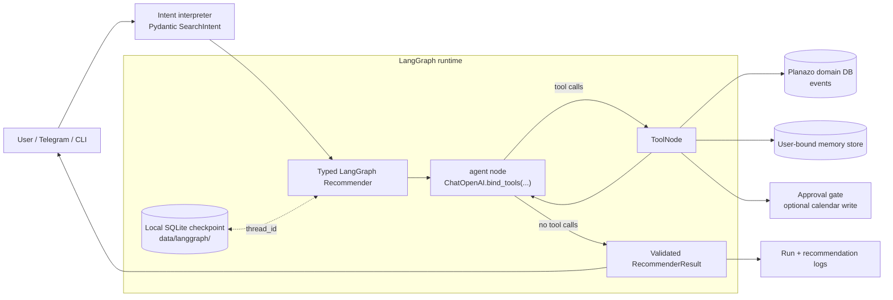
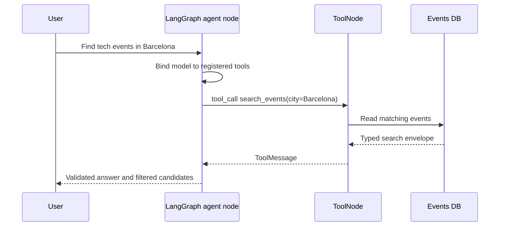
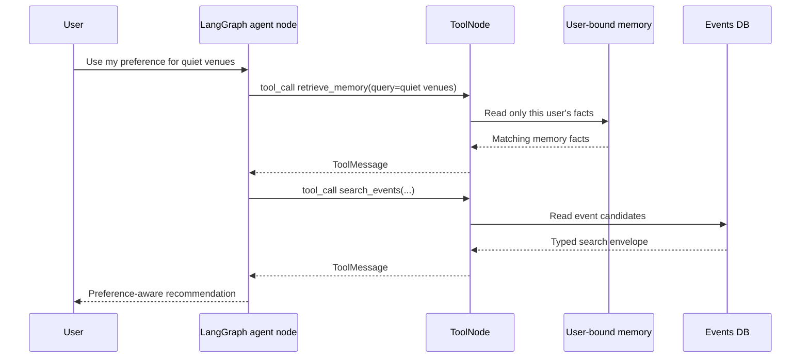
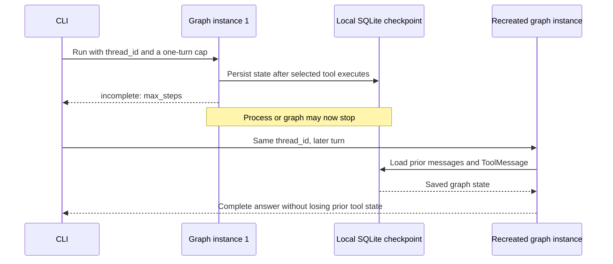

# Planazo

An agentic Barcelona event-discovery assistant. A user asks for events matching a time window and interests; Planazo gathers candidates from selected sources, extracts and validates the details, ranks them, and — on explicit approval — creates a Google Calendar entry.

## Setup and run

The agent runtime lives under [`src/planazo/`](src/planazo/):

```bash
uv sync
uv run pytest
uv run planazo-agent --calendar "save a tech event evt-1 called AI Meetup at 2026-08-01T19:00:00 in Barcelona, confidence 0.9"
uv run python -m planazo.bot
```

The bot needs `TELEGRAM_BOT_TOKEN` in a `.env` at the repo root — copy [`.env.example`](.env.example) and paste the token BotFather gives you.

See [`README-package.md`](README-package.md) for the full CLI, the tools, and the approval-gate behavior.

### Required environment variables

Copy [`.env.example`](.env.example) to `.env` at the repository root and set:

```dotenv
# Required for the LangGraph Recommender and other OpenCode model calls.
OPENCODE_API_KEY=replace-with-a-disposable-opencode-key

# Required only when running the Telegram channel.
TELEGRAM_BOT_TOKEN=replace-with-a-disposable-bot-token
```

Run one Recommender turn through the CLI. `--user-id` must name a valid local
Planazo identity; `--thread-id` makes the durable graph thread explicit.

```bash
uv run planazo-agent --user-id 1 --thread-id demo-events "Find technology events in Barcelona this weekend."
```

## LangGraph Recommender runtime

The Recommender is a custom, typed LangGraph `StateGraph`. It binds the cheap
OpenCode chat model to LangChain tools. The model—not application branching—
decides whether to call a registered tool. LangGraph's `ToolNode` runs the
selected call, then the graph returns to the model only when it made a tool
call.

Pydantic validation remains at Planazo's existing boundaries: search intent,
tool results, preferences, clarification, and public `RecommenderResult`.
Planazo policy remains in the composition root: identity binding, approval,
candidate filtering/ranking, and observability.



### Registered Recommender tools

| Tool | Purpose | Boundary |
| --- | --- | --- |
| `search_events` | Read candidate events from the shared catalog. | Read-only; results are validated and deterministically filtered before candidates are returned. |
| `retrieve_memory` | Retrieve saved facts relevant to the requesting user's cue. | User identity is closed over; the model cannot select another user's memory. |
| `save_memory` | Save a bounded user fact when it is useful to remember. | User identity is closed over. |
| `retrieve_notes` / `save_note` | Read or save scoped user notes. | User identity is closed over. |
| `ask_user` | Record one non-blocking clarification question. | First valid question wins; it never invents a reply. |
| `save_event_candidate` | Optional calendar candidate save. | Reversible calendar helper. |
| `confirm_and_create_calendar_event` | Optional final calendar creation. | Requires the approval gate before dispatch. |

The calendar tools are registered only with `--calendar`. The Recommender does
not register `save_preference` or `dispatch_extraction`.

### Event query: model selects `search_events`



### Preference-aware query: memory, then search



### Interrupted graph: checkpoint and resumed turn



### Demonstrate checkpoint resume

Use the same durable thread ID in both commands. The first is deliberately
capped after one model turn; the second recreates the graph and resumes saved
state. Replace `1` with a valid local Planazo user ID.

```bash
uv run planazo-agent --user-id 1 --thread-id checkpoint-demo --max-steps 1 "Find technology events in Barcelona this weekend."
uv run planazo-agent --user-id 1 --thread-id checkpoint-demo "Continue the previous event search."
```

The local checkpoint database is
`data/langgraph/recommender-checkpoints.sqlite3`; it is ignored by Git and is
separate from Planazo's domain database. A reproducible no-provider demo is:

```bash
uv run pytest tests/test_langgraph_runtime.py::test_sqlite_checkpoint_resumes_a_stopped_tool_turn_after_graph_recreation
```

See [ADR 0023](docs/adr/0023-langgraph-recommender-runtime.md) for the runtime decision.

## Working on the project

- **Rulebook:** [`AGENTS.md`](AGENTS.md) — read this first.
- **Product spec:** [`docs/PLANAZO-PROJECT-CONTEXT.md`](docs/PLANAZO-PROJECT-CONTEXT.md).
- **Decisions:** [`docs/adr/`](docs/adr/) — numbered architecture decision records.
- **Tickets:** GitHub Issues. Use `/writing-development-tickets` in Claude Code to scope one, `/executing-development-tickets` to drive it end-to-end.
