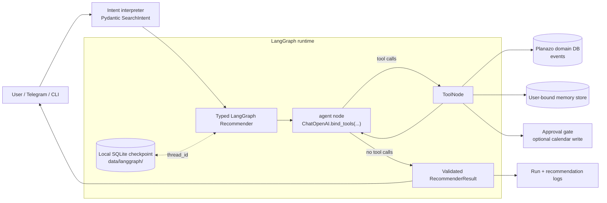
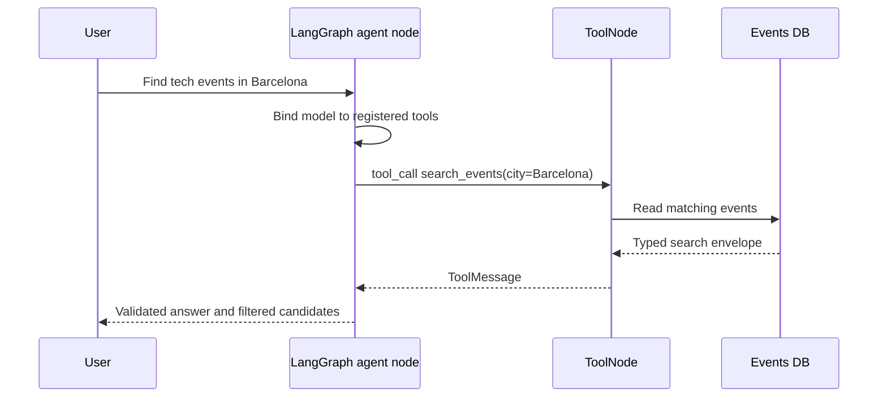
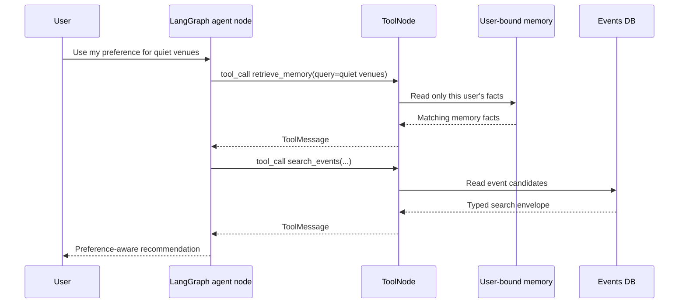
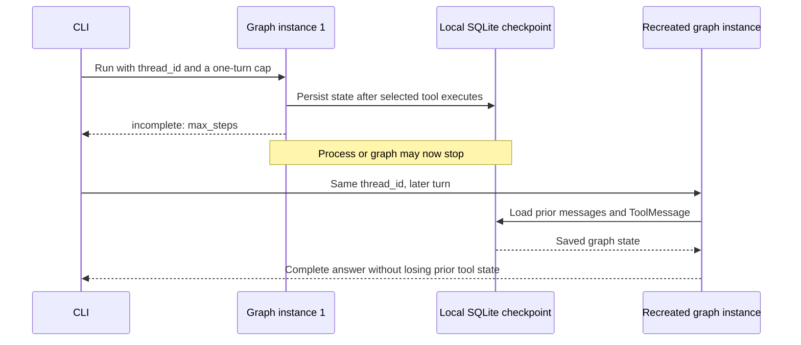
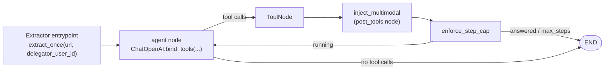

# Planazo

An agentic Barcelona event-discovery assistant. A user asks for events matching a time window and interests; Planazo gathers candidates from selected sources, extracts and validates the details, ranks them, and — on explicit approval — creates a Google Calendar entry.

## Setup and run

The agent runtime lives under [`src/planazo/`](src/planazo/):

### FFmpeg prerequisite

Reel-frame extraction and its tests use the system `ffmpeg` and `ffprobe`
executables. The Python `ffmpeg-python` package installed by `uv sync` is only
a wrapper, so install FFmpeg and ensure both commands are on your `PATH` before
running the full test suite:

```bash
# Windows (Winget)
winget install --id Gyan.FFmpeg.Shared --exact

# macOS (Homebrew)
brew install ffmpeg

# Debian / Ubuntu
sudo apt update && sudo apt install -y ffmpeg
```

Verify the installation with:

```bash
ffmpeg -version
ffprobe -version
```

```bash
uv sync
uv run pytest
uv run planazo-agent --calendar "save a tech event evt-1 called AI Meetup at 2026-08-01T19:00:00 in Barcelona, confidence 0.9"
uv run python -m planazo.bot
```

The bot needs `TELEGRAM_BOT_TOKEN` in a `.env` at the repo root — copy [`.env.example`](.env.example) and paste the token BotFather gives you.

See [`README-package.md`](README-package.md) for the full CLI, the tools, and the approval-gate behavior.

### Required environment variables

Copy [`.env.example`](.env.example) to `.env` at the repository root and set:

```dotenv
# Required for the LangGraph Recommender and other OpenCode model calls.
OPENCODE_API_KEY=replace-with-a-disposable-opencode-key

# Required only when running the Telegram channel.
TELEGRAM_BOT_TOKEN=replace-with-a-disposable-bot-token
```

Run one Recommender turn through the CLI. `--user-id` must name a valid local
Planazo identity; `--thread-id` makes the durable graph thread explicit.

```bash
uv run planazo-agent --user-id 1 --thread-id demo-events "Find technology events in Barcelona this weekend."
```

## LangGraph agent runtimes

Planazo's Recommender and Extractor both run on typed LangGraph `StateGraph`s.
Each graph binds an OpenCode chat model to LangChain tools and lets the
model—not application branching—dispatch tool calls through LangGraph's
`ToolNode`.

### Recommender runtime

The Recommender is a custom, typed LangGraph `StateGraph`. It binds the cheap
OpenCode chat model to LangChain tools. The model—not application branching—
decides whether to call a registered tool. LangGraph's `ToolNode` runs the
selected call, then the graph returns to the model only when it made a tool
call.

Pydantic validation remains at Planazo's existing boundaries: search intent,
tool results, preferences, clarification, and public `RecommenderResult`.
Planazo policy remains in the composition root: identity binding, approval,
candidate filtering/ranking, and observability.



#### Registered Recommender tools

| Tool | Purpose | Boundary |
| --- | --- | --- |
| `search_events` | Read candidate events from the shared catalog. | Read-only; results are validated and deterministically filtered before candidates are returned. |
| `retrieve_memory` | Retrieve saved facts relevant to the requesting user's cue. | User identity is closed over; the model cannot select another user's memory. |
| `save_memory` | Save a bounded user fact when it is useful to remember. | User identity is closed over. |
| `retrieve_notes` / `save_note` | Read or save scoped user notes. | User identity is closed over. |
| `ask_user` | Record one non-blocking clarification question. | First valid question wins; it never invents a reply. |
| `save_event_candidate` | Optional calendar candidate save. | Reversible calendar helper. |
| `confirm_and_create_calendar_event` | Optional final calendar creation. | Requires the approval gate before dispatch. |

The calendar tools are registered only with `--calendar`. The Recommender does
not register `save_preference` or `dispatch_extraction`.

#### Event query: model selects `search_events`



#### Preference-aware query: memory, then search



#### Interrupted graph: checkpoint and resumed turn



#### Demonstrate checkpoint resume

Use the same durable thread ID in both commands. The first is deliberately
capped after one model turn; the second recreates the graph and resumes saved
state. Replace `1` with a valid local Planazo user ID.

```bash
uv run planazo-agent --user-id 1 --thread-id checkpoint-demo --max-steps 1 "Find technology events in Barcelona this weekend."
uv run planazo-agent --user-id 1 --thread-id checkpoint-demo "Continue the previous event search."
```

The local checkpoint database is
`data/langgraph/recommender-checkpoints.sqlite3`; it is ignored by Git and is
separate from Planazo's domain database. A reproducible no-provider demo is:

```bash
uv run pytest tests/test_langgraph_runtime.py::test_sqlite_checkpoint_resumes_a_stopped_tool_turn_after_graph_recreation
```

See [ADR 0023](docs/adr/0023-langgraph-recommender-runtime.md) for the runtime decision.

### Extractor runtime

The Extractor is a custom, typed LangGraph `StateGraph`. It binds the strong
OpenCode chat model to LangChain tools—`fetch_instagram_post`, `save_event`,
and `report_extraction_status`. The model—not application branching—decides
which tool to call. LangGraph's `ToolNode` runs the selected call; after a
successful `fetch_instagram_post`, the graph injects one multimodal
`HumanMessage` carrying the fetched post's image, carousel slides, reel
frames, or thumbnail fallback (per `MultimodalProfile`). The graph then
returns to the model until it emits a terminal `save_event` sequence or a
`report_extraction_status` call.



Terminal state is trace-derived: the graph does not short-circuit on tool
names. The composition root inspects the trace after the run and projects the
final `ExtractorGraphState` into an `ExtractionResult`.

#### Registered Extractor tools

| Tool | Purpose | Boundary |
| --- | --- | --- |
| `fetch_instagram_post` | Read the raw post payload from the Instagram source adapter. | Successful call triggers the multimodal `HumanMessage` injection carrying image, carousel slides, reel frames, or thumbnail fallback (per `MultimodalProfile`). |
| `save_event` | Persist an extracted `Event` to the catalog. | Reversible catalog write—no `ApprovalGate` ([ADR 0002](docs/adr/0002-event-tool-contracts-and-approval-gate.md), [ADR 0005](docs/adr/0005-multi-agent-shape.md) §4). |
| `report_extraction_status` | Terminal unhappy signal for the run (needs_clarification / error branches). | Records the operator-facing status, error_type, and notes; ends the extraction without persisting an event. |

The Extractor is single-shot: no checkpointing, no `thread_id`, no resume. See
[ADR 0024](docs/adr/0024-langgraph-extractor-runtime.md) for the rationale.

## HW3 — RAG over the events catalog

`search_events` is RAG-backed: hard filters gate the candidate set, and — when a
natural-language `query` is present — a hybrid dense + BM25 retriever with
Reciprocal Rank Fusion and cross-encoder reranking ranks within it. The tool
name and its registration point in `planazo.agents.event_agent.run_once` are
the same the Recommender already exposes; the signature gains one optional
`query: str | None`. See [ADR 0025](docs/adr/0025-rag-over-events.md) for the
full decision.

### Retrieval design

- **Chunking.** One chunk per event; overlap zero. The event row is the
  atomic semantic unit — title, description, venue, tags, neighborhood, price,
  and time all live on the same 150-character record and the retriever needs
  them scored together. Chunk IDs are event IDs, so no content-anchor
  resolver is needed.
- **Hybrid retrieval.** Dense embeddings from
  `sentence-transformers/all-MiniLM-L6-v2` (384-dim, in-memory cosine
  similarity) run in parallel with BM25 (`rank-bm25`, whitespace + lowercase
  tokenization). Each retriever returns its top-20.
- **Fusion.** Reciprocal Rank Fusion at `k_rrf = 60` (Cormack, Clarke,
  Büttcher 2009 default) combines the two ranked lists into a 20-item fused
  list.
- **Rerank depth.** The 20-item fused list is reranked down to top-5 with the
  `cross-encoder/ms-marco-MiniLM-L-6-v2` cross-encoder. The 15-chunk gap
  between retrieve depth and return depth is where reranking earns its
  ~200 ms — a chunk RRF ranks #12 can climb to top-3 after cross-encoder
  scoring.
- **Rerank seam.** `build_search_events_rag(events, *, rerank, k)` threads a
  `rerank: bool` through the retrieval layer so the evaluation harness runs
  identical queries with rerank on and off and attributes the score delta to
  the reranker specifically.

### Retrieval metrics

Seed corpus: `data/eval/events_seed.jsonl` (120 events). Golden cases:
`data/eval/questions.jsonl` (20 cases across 6 failure categories). The 2
`out_of_corpus` cases are counted separately and excluded from the means below.

**Overall averages** — copied from
[`data/eval/results/retrieval.md`](data/eval/results/retrieval.md):

| k | rerank | hit@k | precision@k | recall@k | mrr | ndcg@k |
| --- | --- | --- | --- | --- | --- | --- |
| 1 | on | 1.000 | 1.000 | 0.690 | 1.000 | 1.000 |
| 1 | off | 0.889 | 0.889 | 0.620 | 0.944 | 0.889 |
| 3 | on | 1.000 | 0.556 | 0.875 | 1.000 | 0.967 |
| 3 | off | 1.000 | 0.519 | 0.847 | 0.944 | 0.911 |
| 5 | on | 1.000 | 0.411 | 0.958 | 1.000 | 0.974 |
| 5 | off | 1.000 | 0.400 | 0.940 | 0.944 | 0.931 |
| 10 | on | 1.000 | 0.228 | 1.000 | 1.000 | 0.988 |
| 10 | off | 1.000 | 0.222 | 0.986 | 0.944 | 0.944 |

**Per failure category at k = 5** — full k sweep and per-case scores live in
[`data/eval/results/retrieval.md`](data/eval/results/retrieval.md) and
[`data/eval/results/retrieval_per_case.jsonl`](data/eval/results/retrieval_per_case.jsonl):

| failure_category | rerank | hit@5 | precision@5 | recall@5 | mrr | ndcg@5 |
| --- | --- | --- | --- | --- | --- | --- |
| acronym | on | 1.000 | 0.250 | 1.000 | 1.000 | 1.000 |
| acronym | off | 1.000 | 0.250 | 1.000 | 1.000 | 1.000 |
| exact_term | on | 1.000 | 0.360 | 0.967 | 1.000 | 1.000 |
| exact_term | off | 1.000 | 0.360 | 0.967 | 1.000 | 1.000 |
| lexical_semantic_mismatch | on | 1.000 | 0.500 | 0.917 | 1.000 | 0.943 |
| lexical_semantic_mismatch | off | 1.000 | 0.500 | 0.896 | 0.750 | 0.799 |
| multi_hop | on | 1.000 | 0.700 | 0.875 | 1.000 | 0.877 |
| multi_hop | off | 1.000 | 0.600 | 0.750 | 1.000 | 0.779 |
| near_duplicate_noise | on | 1.000 | 0.400 | 1.000 | 1.000 | 1.000 |
| near_duplicate_noise | off | 1.000 | 0.400 | 1.000 | 1.000 | 1.000 |

### Generation metrics

The generation harness uses an LLM-as-judge (`OpenCodeJudge`, cheap-role model,
temperature 0, disk-cached responses under `var/eval/judge_cache/`) to score
three metrics: **Faithfulness** (grounded in retrieved chunks), **Answer
Relevance** (addresses the query), **Context Precision** (retrieved chunks are
relevant). Rerank-on runs the full 20 cases; rerank-off runs a deterministic
10-case subset balanced across failure categories (listed in
[`data/eval/results/generation_subset.md`](data/eval/results/generation_subset.md)).

**Overall averages** — copied from
[`data/eval/results/generation.md`](data/eval/results/generation.md):

| rerank | faithfulness | answer_relevance | context_precision |
| --- | --- | --- | --- |
| on | 0.985 | 0.333 | 0.693 |
| off | 1.000 | 0.415 | 0.580 |

**Per failure category** — per-case scores in
[`data/eval/results/generation_per_case.jsonl`](data/eval/results/generation_per_case.jsonl):

| failure_category | rerank | faithfulness | answer_relevance | context_precision |
| --- | --- | --- | --- | --- |
| acronym | on | 1.000 | 0.075 | 0.700 |
| acronym | off | 1.000 | 0.000 | 0.600 |
| exact_term | on | 0.940 | 0.410 | 0.840 |
| exact_term | off | 1.000 | 0.800 | 0.800 |
| lexical_semantic_mismatch | on | 1.000 | 0.562 | 0.850 |
| lexical_semantic_mismatch | off | 1.000 | 0.550 | 0.600 |
| multi_hop | on | 1.000 | 0.475 | 1.000 |
| multi_hop | off | 1.000 | 0.550 | 0.700 |
| near_duplicate_noise | on | 1.000 | 0.367 | 0.400 |
| near_duplicate_noise | off | 1.000 | 0.350 | 0.400 |
| out_of_corpus | on | 1.000 | 0.000 | 0.125 |
| out_of_corpus | off | 1.000 | 0.000 | 0.000 |

### The disagreement

The two tables tell partially opposite stories, and naming the disagreement is
the point of running both.

**Where they agree.** Context Precision (generation) tracks the retrieval
improvements. Rerank ON lifts Context Precision from 0.580 to 0.693 overall,
with the biggest jumps on `multi_hop` (0.700 → 1.000) and
`lexical_semantic_mismatch` (0.600 → 0.850). This is exactly what the
retrieval table shows: reranking reorders neighboring events out of the top-K
so the chunks that remain are relevant.

**Where they disagree.** Faithfulness (0.985 rerank-on vs 1.000 rerank-off)
and Answer Relevance (0.333 vs 0.415 overall; 0.410 vs 0.800 on `exact_term`)
are higher with rerank OFF. The assignment calls this scenario out
explicitly — a retrieval win that does not become an answer win.

**Diagnosis.** With rerank OFF, the retriever returns fewer semantically-tight
matches, the deterministic answer-composer emits a shorter answer, and a
shorter answer offers less surface area for hallucination (higher
Faithfulness) and — in categories with a single obvious hit like
`exact_term` — less content the judge can flag as off-topic (higher Answer
Relevance). This is a measurement asymmetry, not a rerank failure: the
"answer" in HW3 is a deterministic format-of-retrieved-events string, not an
LLM-generated response, and the judge is scoring compressed strings against
short queries where covering the golden hit exactly can beat covering more of
the neighboring events. HW3 measures generation-given-retrieval; agent-level
answer generation is HW-agent scope and out of scope here.

### Judge bias

The LLM-as-judge inherits four well-known biases that we name and mitigate
rather than hide:

- **Position bias** — the judge weights earlier context more heavily.
  Mitigated by scoring each metric with a single-role prompt and passing the
  retrieved chunks in a fixed, model-independent order.
- **Verbosity bias** — the judge tends to prefer longer, more elaborated
  answers. **This one is visible in the numbers**: Answer Relevance is
  higher with rerank OFF because the composed answer is shorter and more
  targeted. We name the bias rather than "correct" for it; the retrieval
  metrics are the load-bearing signal for retriever quality.
- **Self-preference** — same model family may judge itself favorably.
  Mitigated by running the judge at temperature 0 with bounded outputs and no
  chain-of-thought that could reveal retrieval configuration.
- **Judge-model mismatch** — the judge is the cheap role, not the same model
  the Recommender uses. Mitigated by keeping the judge model constant across
  all runs so rerank-on vs rerank-off is a controlled comparison.

### Failure modes fixed by each pipeline stage

- **BM25 over dense-only.** `exact_term` and `acronym` sit at ceiling for
  hit@1, precision, recall, MRR, and nDCG with or without rerank. Both
  categories rely on tokens the dense encoder tends to smear ("OBC", "FIB",
  named venue strings); BM25's exact-token match is what carries them.
- **RRF over BM25.** `lexical_semantic_mismatch` cases — "cheap flamenco",
  "budget jazz night" — are where dense recall is strong (semantically close
  neighbors) and BM25 alone would miss (surface tokens don't align). RRF
  combines the two into a 20-item fused list that catches both signal types.
- **Rerank over RRF.** The cross-encoder earns its ~200 ms on
  `lexical_semantic_mismatch` (hit@1 jumps 0.500 → 1.000, MRR 0.750 → 1.000)
  and `multi_hop` (Context Precision 0.700 → 1.000, precision@5 0.600 →
  0.700). These are the cases where the correct event ranks #7–#12 out of
  RRF and needs cross-encoder scoring to climb into the top-K.
- **Where rerank hurts.** Answer Relevance on `exact_term` drops from 0.800
  to 0.410 with rerank on — see the disagreement analysis above.
  Verbosity bias in the judge plus a deterministic answer composer explain
  the drop; retrieval quality itself does not regress.

### Reproduce

The retrieval and generation harnesses are runnable end-to-end from a clean
checkout. The judge cache is committed under `var/eval/judge_cache/`, so the
generation rerun is free.

```bash
uv sync
uv run python scripts/run_retrieval_eval.py --k 1 3 5 10 --rerank on off
uv run python scripts/run_generation_eval.py --rerank on off --rerank-off-subset 10
```

Outputs land in `data/eval/results/` — markdown tables plus per-case JSONL.
First run downloads ~160 MB of sentence-transformers weights into
`~/.cache/huggingface/`; subsequent runs are offline.

### Links

- Decision: [ADR 0025 — RAG over the events catalog](docs/adr/0025-rag-over-events.md)
- Retrieval results: [`data/eval/results/retrieval.md`](data/eval/results/retrieval.md), [`retrieval_per_case.jsonl`](data/eval/results/retrieval_per_case.jsonl)
- Generation results: [`data/eval/results/generation.md`](data/eval/results/generation.md), [`generation_per_case.jsonl`](data/eval/results/generation_per_case.jsonl), [`generation_subset.md`](data/eval/results/generation_subset.md)
- Seed corpus: [`data/eval/events_seed.jsonl`](data/eval/events_seed.jsonl), [`generation_prompt.md`](data/eval/generation_prompt.md)
- Golden cases: [`data/eval/questions.jsonl`](data/eval/questions.jsonl)

## Working on the project

- **Rulebook:** [`AGENTS.md`](AGENTS.md) — read this first.
- **Product spec:** [`docs/PLANAZO-PROJECT-CONTEXT.md`](docs/PLANAZO-PROJECT-CONTEXT.md).
- **Decisions:** [`docs/adr/`](docs/adr/) — numbered architecture decision records.
- **New to the code?** — [`docs/LEARNING-GUIDE.md`](docs/LEARNING-GUIDE.md) walks through HW1 / HW3 / HW4 in plain language, defining each concept and library on first use and pointing at real files.
- **Tickets:** GitHub Issues. Use `/writing-development-tickets` in Claude Code to scope one, `/executing-development-tickets` to drive it end-to-end.
